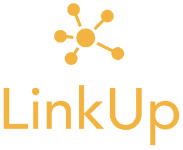
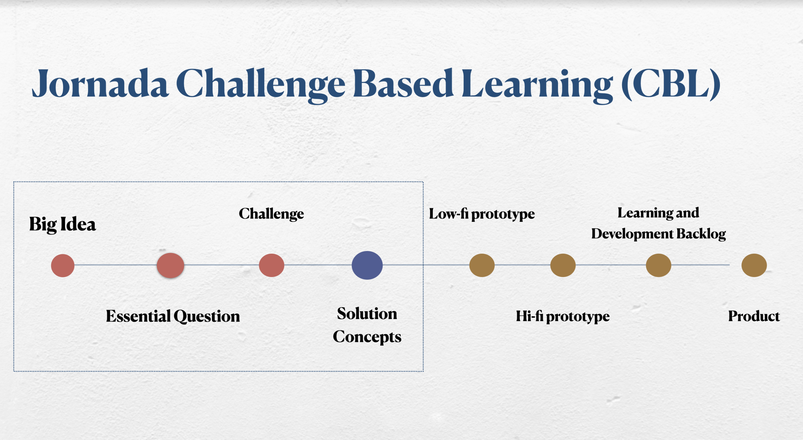
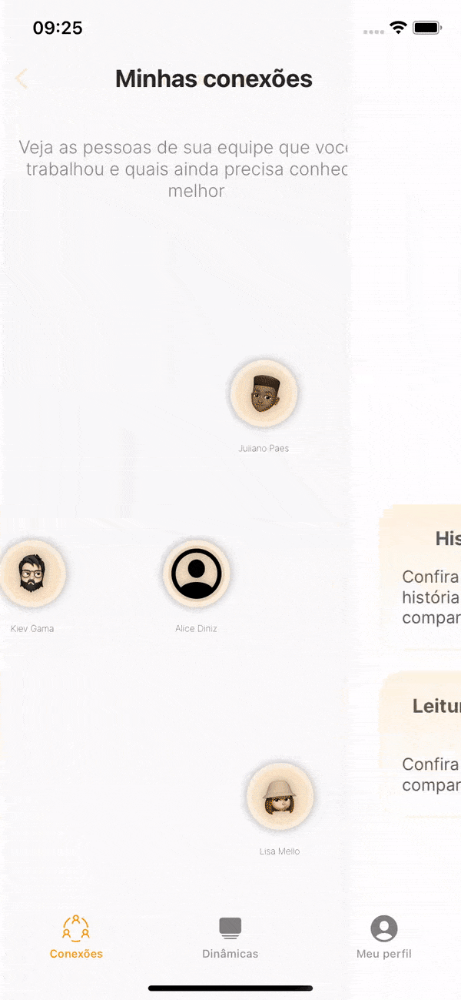
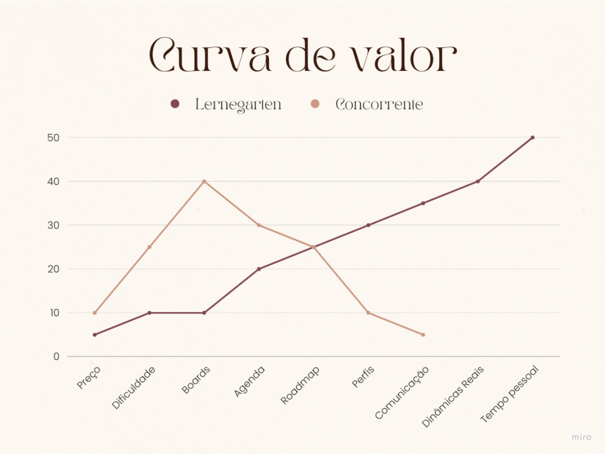
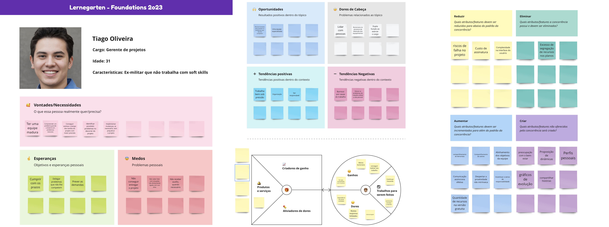
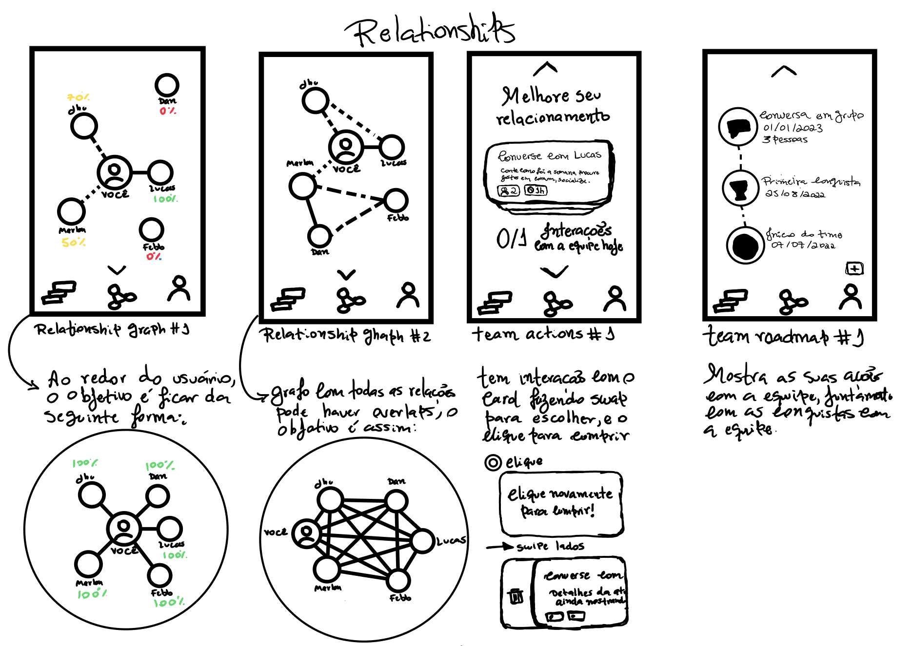
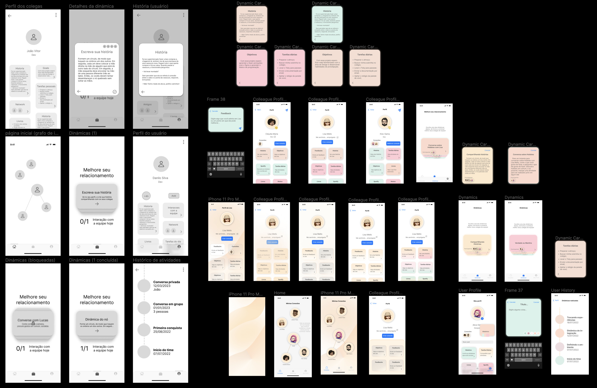
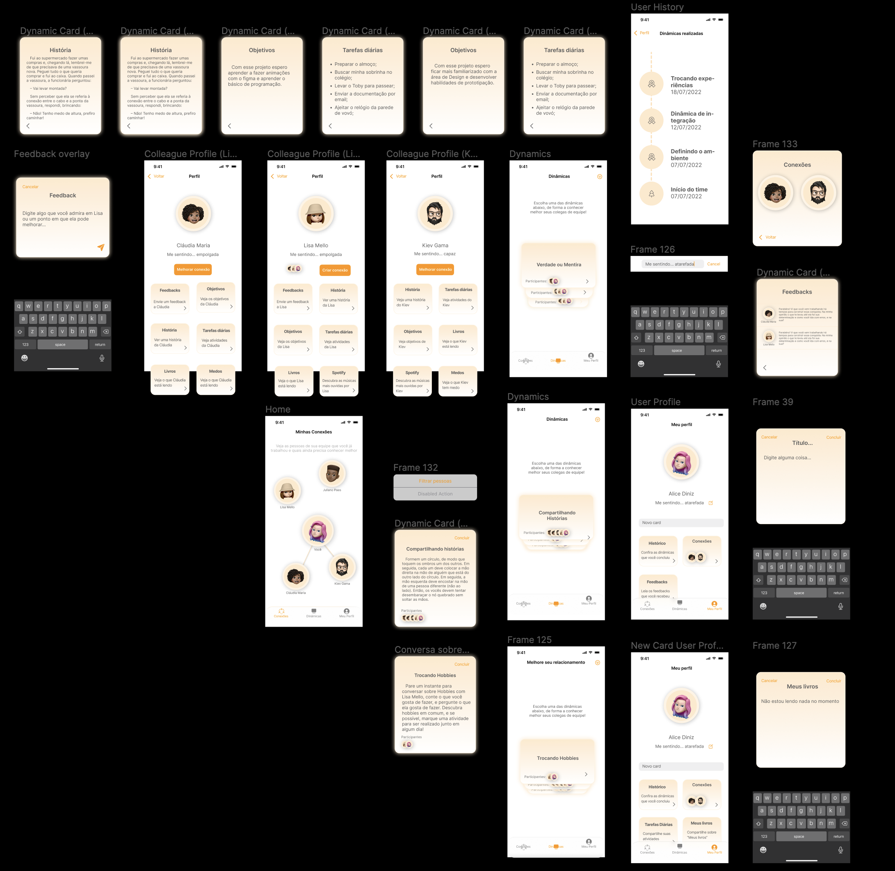
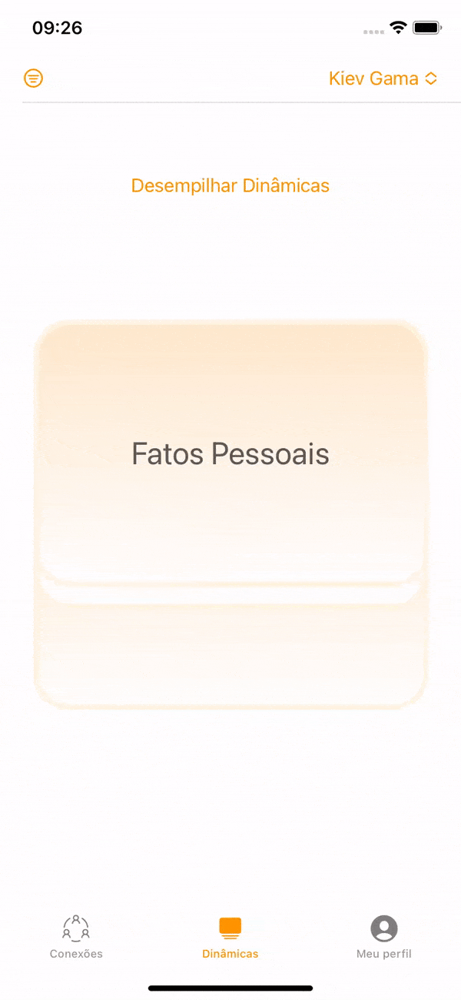

  

> An iOS app powered by [SwiftUI](https://developer.apple.com/documentation/SwiftUI) framework to increase the relationship between groupmates, developed over [CBL framework](https://www.challengebasedlearning.org/framework/) and [LISS](https://medium.com/appledeveloperacademy-ufpe/um-espaço-seguro-para-a-aprendizagem-de-inovação-liss-26208fbb02a4)

## Motivation

This app was developed on [*IF810 - Tópicos Avançados em Negócios Online e Empreendedorismo*](https://www.developeracademy.cin.ufpe.br/foundations) class, that occurs on the same space of *Apple Academy* project, teaching about Design, IOS development and Inovation, using CBL and LISS inovation/teaching frameworks

## Inovation journey

> The Challenge Learning Framework is divided into three interconnected phases: Engage, Investigate and Act.

Firstly we were grouped into groups by our interesting areas (eg music, security, health...). So we started the Engage step choosing a *Sub Big Idea* (Teams Management) over the preselected *Big Idea* (Academy).

Into the Investigate step, we did some *Guiding Questions* (like "How to present people to each other?" or "What encourages people to engage with a project") to extract our *Essential Question* (How can Team Management help in the execution of a project at the academy?) of the Engage step.

Finally we started the definition of our stakeholders to interview with some questions like "How to keep the team engaged?" or "How to identify impostors?". To "complete" the Engage step, we defined our Challenge using some objectives that our solution can help our persona, like "To ensure the team performance" or "To eliminate process burocracy". So our Challenge definition stayed *"Create a project manager that helps in the good interpersonal relationship of the team"*.

With a Challenge defined, we did the competitor analysis to create the value curve and define our app **unique value proposition**: "Offer an intuitive solution for managing teams that work on innovative projects, aiming at good team relationships and personal well-being".

### Prototyping

We learned and use the [Human Interface Guidelines](https://developer.apple.com/design/human-interface-guidelines/) and the iOS UI Kit to [prototyping](https://www.figma.com/file/DwvcR5fshrIDC7t2NzjtiV/Foundations?node-id=0-1&t=2Ag3tGyyDL5cC9r4-0) our solution.

#### Low fi

#### Mid fi and High fi

#### High fi after feedback

#### Final High fi

### Development

> Learning Innovation Safe Space (LISS): A learning environment for innovation that promotes emotional safety and collaboration so everyone can feel confident when facing challenges.

We used SwiftUI framework organized by MVVM architecture. Our solution has the following features:

 - [x] A flexible connected graph to see the strength of the connection from you to your team.
 - [x] Improve relationship feature with five levels of connection.
 - [x] Share and see cards between the groupmates
 - [x] Share and see your momment feeling
 - [x] See your groupmates feedbacks to you
 - [x] Multiple vision of dynamics to do with your team or specific groupmates
 - [x] Dynamics filter by integrant name
 - [x] Gestures on dynamics page
 - [x] Create, edit or delete cards of your profile
 - [x] Customize your memoji

Finally, we present our pitch to Academies.

---

- [José Danilo](https://github.com/JDaniloC)
- [Maria Eduarda](https://github.com/Madu218)
- [Jailson Júnior](https://github.com/Jailsonsdsj)
- [André Filho](https://github.com/mrdedede)
- [Mateus Tavares](https://github.com/mateusnotgado)
